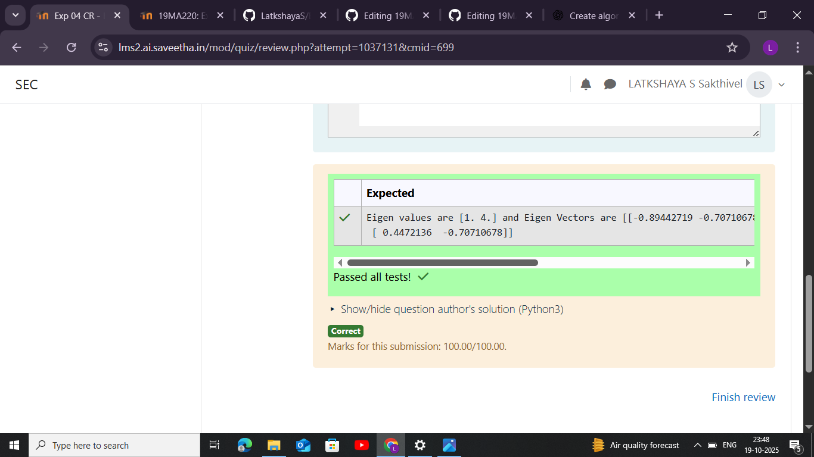

# EIGENVALUES-AND-EIGENVECTORS
## AIM:
To write a python program to find the Eigenvalues and Eigen Vectors
## EQUIPMENT'S REQUIRED:
1. 	Hardware – PCs
2. 	Anaconda – Python 3.7 Installation / Moodle-Code Runner
## ALGORITHM:
###  Step 1:
Import the numpy module to use its built-in mathematical functions.
###Step 2:
Create a square matrix and assign it to a variable using np.array().
###Step 3:
Using the np.linalg.eig(), find the eigenvalues and eigenvectors of the given matrix.
###Step 4:
Display the eigenvalues and eigenvectors and end the program.
## PROGRAM:
```
#Program to find the eigen values and eigen vectors.
#Developed by: 
#RegisterNumber:
import numpy as np
a=np.array([[2,2],[1,3]])
val,vec=np.linalg.eig(a)
print(f"Eigen values are {val} and Eigen Vectors are {vec}")

```

## OUTPUT:

## RESULT:
Thus the Eigenvalue and Eigenvector is successfully solved using python program
